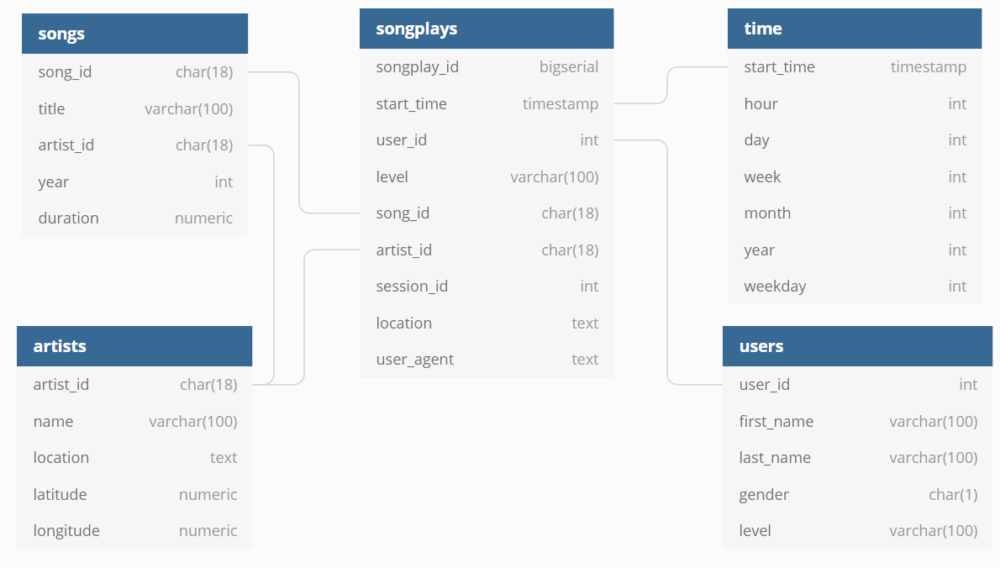

# Project: Data Modeling with PostgreSQL

## Project Goals

`Sparkify` is a startup which focused on music streaming. They have a lot of archive data with information about songs and artists. Also Sparkify collects information which tracks users of their service listen to.
Sparkify wants to analyze collected data to better understand preferences of their users. All collected data is stored as bunch of JSON files which makes the task of data analysis and reporting difficult to solve.

The main goal of this aims to solve this problem. The solution is to use relational database (PostgreSQL) and create a proper data model to represent all the company data about songs, artists and tracks which users listen to in the form convenient for analysis.
Relational database is suitable well for this goal because it allows to query data using SQL.

Project goals summary:

- Create data model for the PostgreSQL to represent Sparkify data in form convenient for analysis.
- Build ETL pipeline to process raw data which is stored in JSON files and insert it to the relational database.
- Prepare dashboard with examples of analytical queries against relational database.

## Database schema

Database schema contains 4 dimension tables (songs, artists, users and time) and 1 fact table (songplays):
- `songs` dimension table contains information about each song in the Sparkify collection.
- `artists` dimension table contains information about artists.
- `users` dimension table describes Sparkify service users.
- `time` dimension table serves for better describe time intervals.
- `songplays` fact table keeps information what (and when) users are listen to.

> Remark 1. `songplays` table contains auto-increment key to unique identify each row. Bigserial data type was chosen because this table suppose to grow very fast. 

> Remark 2. `songplays` contains some redundant data, for example field `level` is duplicated in the `users` table. This is done intentionally to avoid unnecessary table joins while querying the data which can significantly improve query performance.

> Remark 3. There are no explicit references (foreign keys) in the database. It is done for optimize ETL workflow. ETL pipeline is responsible for the data consistency.   

Full database schema is shown on the following image:



## Project files

This project is implemented using [Python](https://www.python.org/) programming language and [Jupyter notebooks](https://jupyter.org/) to test and represent results.

Here is the list of project files and their purpose:

- `sql_queries.py` contains all SQL queries for DROP and CREATE all tables in database, also it contains SELECT query to find required data which used during ETL pipeline.
- `create_tables.py` is used to prepare a new database for future work. It uses `sql_queries.py` to run DROP and CREATE table statements to re-create all the tables.
- `etl.py` implements the ETL pipeline. This script processes all the JSON files and fill the relational database.
- `etl.ipynb` is a Jupyter notebook which allows user to step by step test all steps from the ETL pipeline, but it works only with a single song and single artist instead of all songs and artists. `Do not use it in the production.`
- `test.ipynb` is a Jupyter notebook to quick check data that currently written in the database during the development process. `Do not use it in the production.`
- `dashboard.ipynb` is a Jupyter notebook for the BI-team to run analytical queries against sparkifydb.
- `README.md` – this README file. 

## How to prepare the database and run ETL pipeline

1. Run `create_tables.py`. For example, you can do it from the Terminal:
    
    ```bash
    python create_tables.py
    ```
   
2. Run `etl.py` to execute the ETL pipeline:
   
   ```bash
   python etl.py 
   ```

If both steps are executed correctly without errors then the database is ready for analytic queries.

## Dashboard for analytic queries

`dashboard.ipynb` has examples of analytical queries against `sparkifydb`.

Currently, you can run following queries:
- How many unique users have Sparkify? How many free/paid users?
- Find top 10 most popular songs to build top charts.
- Report: Weekly statistics to understand how many songs users listen weekly and how many unique users use Sparkify.

and of course you can write your own queries!