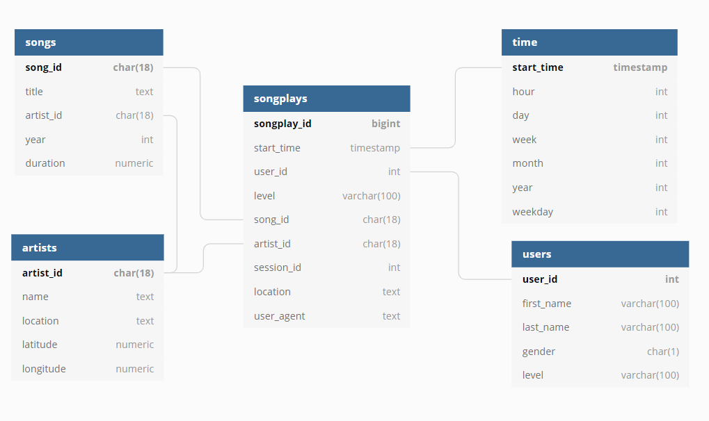

# Project: Data Warehouse

## Project Goals

`Sparkify` is a startup which focused on music streaming. They have a lot of archive data with information about songs and artists (metadata). Also Sparkify collects information which tracks users of their service listen to.
Sparkify wants to analyze collected data to better understand preferences of their users. 
Sparkify chooses [Amazon Web Services (AWS)](https://aws.amazon.com/) as cloud provider and store all collected raw data as JSON files on the Amazon S3 storage.

The main goal of this project is to build the Date Warehouse (DWH) to solve the analytical tasks of the company.
According to the fact that Sparkify already choose the AWS as cloud provider the Amazon Redshift is chosen as the DWH solution.  

Project goals summary:

- Setup and run the Amazon Redshift cluster in the AWS.
- Create data model in Amazon Redshift includes staging area for raw date and star schema for analytic queries.
- Build ETL pipeline to load raw data from Amazon S3 storage to the staging area and then load data from staging area to the star schema tables.
- Prepare dashboard with examples of analytic queries against relational database.

## ETL pipeline clarification

The ETL pipeline consists of two stages:

1. Load raw data from the Amazon S3 storage to the staging area in the Amazon Redshift as is. This step allows to use COPY operation for the batch load the raw data. The data is extracted from JSON and landed to the staging tables. On this step saved all the data as is without quality checking and any transformation or aggregation.
This step is necessary because it will speed up data loading from blobs and also prepare data for the second ETL pipeline step which includes JOINs to repartition the raw data and load it to star schema.

2. Load data from staging tables to the star schema tables. This step includes repartition of data and data quality checks to ensure data integrity.

## Data model for the Sparkify database in Amazon Redshift

Sparkify database uses schemas mechanism to separate staging area from the star schema tables:
- `stg` (short for _staging_) schema is used for staging tables.
- `public` schema (default schema in Amazon Redshift) is used for data analysis team and contains star schema.

### Staging area data model

`stg` schema contains two tables:
- `events` table contains raw events from the Sparkify application/website with information about user activities.
- `songs` table contains meta information about songs and authors. 

Staging area tables is shown on the following picture:


### Data model for data analysis team

Data analysis team need to build various reports and ad-hoc queries. To meet these requirements star schema is used. This allows us to present data in a more convenient way for analysts and also to reduce the number of joins in queries.

Star schema contains 4 dimension tables (songs, artists, users and time) and 1 fact table (songplays):
- `songs` dimension table contains information about each song in the Sparkify collection.
- `artists` dimension table contains information about artists.
- `users` dimension table describes Sparkify service users.
- `time` dimension table serves for better describe time intervals.
- `songplays` fact table keeps information what (and when) users are listen to.

> Remark 1. `songplays` table contains auto-increment key to unique identify each row. 

> Remark 2. `songplays` contains some redundant data, for example field `level` is duplicated in the `users` table. This is done intentionally to avoid unnecessary table joins while querying the data which can significantly improve query performance.
   

Star schema is shown on the following image:



## Project files

This project is implemented using [Python](https://www.python.org/) programming language and [Jupyter notebooks](https://jupyter.org/) to test and represent results.

Here is the list of project files and their purpose:

- `sql_queries.py` contains all SQL queries for DROP and CREATE all tables in the Amazon Redshift and contains load data scripts for both steps of the ETL pipeline.
- `create_tables.py` is used to prepare a new database in the Amazon Redshift for future work. It uses `sql_queries.py` to run DROP and CREATE table statements to re-create all the tables.
- `etl.py` implements the ETL pipeline. This script load (and processes) JSON files from Amazon S3 storage to Amazon Redshift.
- `dashboard.ipynb` is a Jupyter notebook for the BI-team to run analytic queries against Amazon Redshift.
- `dwh.cfg` configuration file which contains settings to connect to the AWS.
- `README.md` – this README file. 

## How to prepare the Amazon Redshift cluster

1. Create IAM role to allow Amazon Redshift to read data from Amazon S3 and allow external connections to the Amazon Redshift. Ask your infrastructure engineers to complete these step.

2. Run Amazon Redshift cluster. Minimal cluster configuration is:

- `dc2.large` nodes x4. 

## How to run ETL pipeline

1. Run `create_tables.py`. For example, you can do it from the Terminal:
    
    ```bash
    python create_tables.py
    ```
   
2. Run `etl.py` to execute the ETL pipeline:
   
   ```bash
   python etl.py 
   ```

If both steps are executed correctly without errors then the DWH is ready for analytic queries.

## Dashboard for analytic queries

`dashboard.ipynb` has examples of analytic queries against `sparkifydb`.

Currently, you can run following queries:
- How many unique users have Sparkify? How many free/paid users?
- Find top 10 most popular songs to build top charts.
- Report: Weekly statistics to understand how many songs users listen weekly and how many unique users use Sparkify.

and of course you can write your own queries!