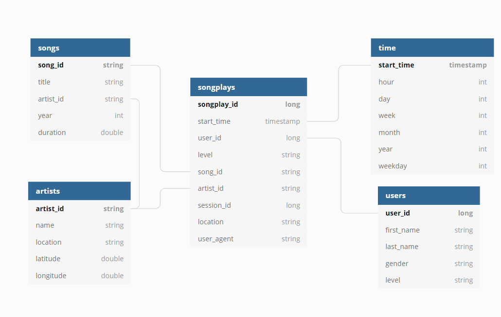

# Project: Data Lake

## Project Goals

`Sparkify` is a startup which focused on music streaming. They have a lot of archive data with information about songs and artists (metadata). Also Sparkify collects information which tracks users of their service listen to.
Sparkify wants to analyze collected data to better understand preferences of their users. 
Sparkify chooses [Amazon Web Services (AWS)](https://aws.amazon.com/) as cloud provider and store all collected raw data as JSON files on the Amazon S3 storage.
As company grown their user base it collects a lot of different data in various formats. Thus it is natural way to evolve company data architecture to the Data Lake.

The main goal of this project is to build the Date Lake to solve the analytical tasks of the company and process raw data stored in the S3 using Spark. It is required to allow data analysts to work with well-known dimensions and facts table using Spark SQL, which allows them to use their SQL queries as is.
According to the fact that Sparkify already choose the AWS as cloud provider to build a Data Lake we will use S3 as a storage and AWS EMR to run the Spark cluster (currently we do not need HDFS, just using Spark-only against S3).  

Project goals summary:

- Prepare infrastructure for the DataLake (including S3 bucket for the Dimensions and Fact tables and AWS EMR Spark Cluster).
- Build ETL pipeline to load raw data from Amazon S3 storage and process it using Spark.
- Create schemas for the output tables dimensional and fact tables, create data frames according to this schemas and store them as parquet files to S3.
- Prepare dashboard with examples of analytic queries against prepared tables in the DataLake.

## ETL pipeline clarification

Raw songs and logs datasets already loaded to the S3 and our goal to process it and create dimensions and fact tables and store it to the Data Lake for future analyses.
ETL pipeline is written using PySpark, it reads raw data from S3 storage, process it, cleanup and deduplicate data, create dimensions and fact tables and store it back to the S3 for analysts team.

## Data model for data analysis team

Data analysis team need to build various reports and ad-hoc queries. To meet these requirements star schema is used. This allows us to present data in a more convenient way for analysts and also to reduce the number of joins in queries.
Analysis team will use Spark SQL which allows them to leverage all benefits from SQL syntax while working against Data Lake.

Star schema contains 4 dimension tables (songs, artists, users and time) and 1 fact table (songplays):
- `songs` dimension table contains information about each song in the Sparkify collection.
- `artists` dimension table contains information about artists.
- `users` dimension table describes Sparkify service users.
- `time` dimension table serves for better describe time intervals.
- `songplays` fact table keeps information what (and when) users are listen to.

> Remark 1. `songplays` table contains auto-increment key to unique identify each row. 

> Remark 2. `songplays` contains some redundant data, for example field `level` is duplicated in the `users` table. This is done intentionally to avoid unnecessary table joins while querying the data which can significantly improve query performance.

Star schema is shown on the following image:



## Project files

This project is implemented using [Python](https://www.python.org/) programming language, [PySpark](https://spark.apache.org/docs/latest/api/python/index.html) libraries and [Jupyter notebooks](https://jupyter.org/) to test and represent results.

Here is the list of project files and their purpose:

- `etl.py` implements the ETL pipeline. This script load (and processes) JSON files from Amazon S3 storage using PySpark and store dimensions and fact tables back to S3 as the result.
- `dashboard.ipynb` is a Jupyter notebook for the BI-team to run analytic queries against Data Lake using Spark SQL.
- `dl.cfg` configuration file which contains settings to connect to the Amazon S3.
- `README.md` – this README file. 

## How to run ETL pipeline to create dimensional and fact tables

1. Edit `dl.cfg` file and fill all variables to access S3 storage.
    > CAUTION. This information can be stored in the repository because using this variables anyone can get access your data!

2. Run `etl.py` in terminal to execute the ETL pipeline:
   
   ```bash
   python etl.py 
   ```

## Dashboard for analytic queries

`dashboard.ipynb` has examples of analytic queries against Sparkify Date Warehouse.

Currently, you can run following queries:
- Find top 10 most popular songs to build top charts.
- Report: Weekly statistics to understand how many songs users listen weekly and how many unique users use Sparkify.

and of course you can write your own queries!